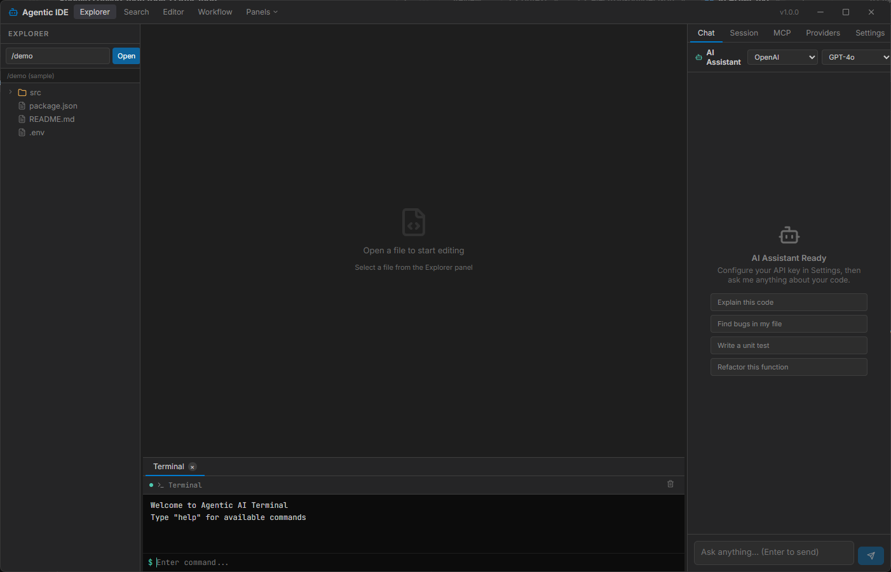

# Agentic Atlantis IDE CLI

A powerful, AI-enhanced desktop IDE with CLI and full command prompt access built with Electron, React, and Vite. Designed for modern developers who want intelligent coding assistance directly in their development environment.



## Features

### Core IDE Features
- **File Explorer** - Browse and manage project files with intuitive navigation
- **Code Editor** - Full-featured code editing with syntax highlighting (Monaco Editor)
- **Multi-tab Editor** - Work on multiple files simultaneously
- **Integrated Terminal** - Built-in terminal with full shell support
- **Settings Panel** - Comprehensive configuration for all IDE features

### AI-Powered Features
- **AI Chat Interface** - Conversational AI assistant for code help, debugging, and explanations
- **Multi-Provider Support** - Connect to multiple AI providers:
  - OpenAI (GPT-4o, GPT-4o Mini, GPT-3.5 Turbo)
  - Anthropic (Claude 3.5 Sonnet, Claude 3 Haiku)
  - Google Gemini (Gemini 2.0 Flash, Gemini 1.5 Pro)
  - Ollama (Local AI - Llama3, Mistral, CodeLlama, etc.)
  - Custom/OpenAI-compatible providers
- **Model Selection** - Choose and switch between available models per provider
- **Provider Configuration** - Full provider.json support for custom AI endpoints

### Workflow & Automation
- **Workflow Editor** - Visual workflow creation with node-based interface
- **MCP (Model Context Protocol)** - Integration support for extended AI capabilities
- **Automation Scripts** - Write and execute automation scripts

### Advanced CLI & Extensibility
- **Powerful CLI** - Command-line interface for all IDE operations
- **LSP (Language Server Protocol)** - Full LSP client support for:
  - IntelliSense & autocomplete
  - Code navigation (Go to definition, Find references)
  - Diagnostics (errors, warnings, linting)
  - Refactoring tools
  - Multi-language support (JavaScript, TypeScript, Python, Rust, Go, C++, etc.)
- **MCP Integration** - Connect to Model Context Protocol servers:
  - File system operations
  - Git integration
  - Database tools
  - Custom AI tools
- **Plugin System** - Extend IDE functionality:
  - Theme plugins
  - Language support
  - Tool integrations
  - Custom commands
- **Extension API** - Build and load custom extensions
- **Hot Reload** - Develop extensions without restarting

## Installation

### Prerequisites
- Node.js 18+ 
- npm or yarn

### Development Setup

```bash
# Clone the repository
git clone https://github.com/qubexs/agentic-atlantis.git
cd agentic-atlantis

# Install dependencies
npm install

# Start development server
npm run dev
```

### Building for Production

```bash
# Build frontend
npm run build

# Build Electron app for Windows
npx electron-builder --win --dir

# Build Electron app for macOS
npx electron-builder --mac --dir

# Build Electron app for Linux
npx electron-builder --linux --dir

# Build distributable installers
npx electron-builder --win
npx electron-builder --mac
npx electron-builder --linux
```

## CLI Commands

The IDE includes a powerful command-line interface:

### File Operations
```bash
atlantis file open <path>          # Open a file
atlantis file save                # Save current file
atlantis file close               # Close current tab
atlantis file new                 # Create new file
```

### AI Commands
```bash
atlantis ai chat                  # Start AI chat
atlantis ai provider list         # List available providers
atlantis ai provider set <name>   # Set active provider
atlantis ai model set <model>     # Set active model
atlantis ai config                # Open AI settings
```

### Terminal Commands
```bash
atlantis term new                 # Create new terminal
atlantis term kill <id>           # Kill terminal session
atlantis term list                # List active terminals
```

### Extension Commands
```bash
atlantis ext list                 # List installed extensions
atlantis ext install <name>      # Install extension
atlantis ext uninstall <name>    # Uninstall extension
atlantis ext search <query>       # Search extensions
atlantis ext dev                  # Development mode
```

### MCP Commands
```bash
atlantis mcp list                 # List MCP servers
atlantis mcp add <name> <config> # Add MCP server
atlantis mcp remove <name>       # Remove MCP server
atlantis mcp start <name>        # Start MCP server
atlantis mcp stop <name>         # Stop MCP server
```

### LSP Commands
```bash
atlantis lsp list                 # List language servers
atlantis lsp start <lang>         # Start LSP for language
atlantis lsp stop <lang>          # Stop LSP for language
atlantis lsp status               # Show LSP status
atlantis lsp install <lang>      # Install language server
```

### Settings Commands
```bash
atlantis settings open            # Open settings
atlantis settings get <key>       # Get setting value
atlantis settings set <key> <val> # Set setting value
atlantis settings reset           # Reset to defaults
```

## Configuration

### AI Provider Setup

1. Open **Settings** (Ctrl+,)
2. Navigate to **Model** tab
3. Select your provider from the dropdown
4. Enter your API key
5. Choose your model

### Adding Custom Providers

You can add custom OpenAI-compatible providers via the provider.json configuration:

1. Click the gear icon in the Model settings
2. Edit the provider.json configuration
3. Add your custom provider with models

Example provider.json format:
```json
{
  "provider": {
    "myprovider": {
      "npm": "@ai-sdk/openai-compatible",
      "options": {
        "baseURL": "https://api.myprovider.com/v1",
        "apiKey": "{env:MY_API_KEY}"
      },
      "models": {
        "model-id": { "name": "Display Name" }
      }
    }
  }
}
```

### LSP Configuration

Configure language servers in settings:

```json
{
  "lsp": {
    "typescript": {
      "enable": true,
      "command": "typescript-language-server",
      "args": ["--stdio"]
    },
    "python": {
      "enable": true,
      "command": "pylsp"
    },
    "rust": {
      "enable": true,
      "command": "rust-analyzer"
    }
  }
}
```

### MCP Configuration

```json
{
  "mcp": {
    "servers": {
      "filesystem": {
        "command": "npx",
        "args": ["@modelcontextprotocol/server-filesystem", "/path/to/directory"]
      },
      "git": {
        "command": "npx", 
        "args": ["@modelcontextprotocol/server-github"]
      }
    }
  }
}
```

### Plugin Configuration

```json
{
  "plugins": {
    "enabled": ["theme-dark", "format-prettier", "git-integration"],
    "paths": ["./my-plugins"]
  }
}
```

## Extension Development

Create your own extensions:

```typescript
// my-extension/index.ts
import { Extension } from '@atlantis/api';

export default {
  name: 'my-extension',
  version: '1.0.0',
  
  activate() {
    // Register commands
    this.registerCommand('my-command', () => {
      console.log('Hello from my extension!');
    });
    
    // Add UI elements
    this.addStatusBarItem({
      text: 'My Extension',
      command: 'my-command'
    });
  },
  
  deactivate() {
    // Cleanup
  }
} satisfies Extension;
```

## Keyboard Shortcuts

| Action | Shortcut |
|--------|----------|
| Save file | Ctrl+S |
| Open settings | Ctrl+, |
| Toggle sidebar | Ctrl+B |
| New terminal | Ctrl+` |
| Focus chat input | Ctrl+L |
| Open file | Ctrl+K |
| Command palette | Ctrl+Shift+P |
| Choose model | Ctrl+' |
| Navigate back | Ctrl+[ |
| Navigate forward | Ctrl+] |
| Close tab | Ctrl+W |
| Quick open | Ctrl+P |
| Find in files | Ctrl+Shift+F |

## Tech Stack

- **Electron 41** - Desktop application framework
- **React 18** - UI library
- **Vite 5** - Build tool
- **TypeScript** - Type safety
- **Monaco Editor** - Code editing
- **Zustand** - State management
- **xterm.js** - Terminal emulation
- **ReactFlow** - Workflow visualization

## Project Structure

```
agentic-atlantis/
├── electron/           # Electron main & preload scripts
│   ├── main/          # Main process
│   │   ├── index.ts   # Main entry
│   │   ├── ipc.ts     # IPC handlers
│   │   ├── cli.ts     # CLI implementation
│   │   ├── mcp.ts     # MCP client
│   │   └── lsp.ts     # LSP client
│   └── preload/       # Preload scripts
├── src/               # React source code
│   ├── components/    # React components
│   │   ├── Editor/    # Code editor
│   │   ├── Terminal/  # Terminal
│   │   ├── Chat/      # AI chat
│   │   ├── Workflow/  # Workflow editor
│   │   └── Settings/  # Settings panel
│   ├── store/         # Zustand state management
│   ├── services/      # LSP, MCP services
│   ├── extensions/    # Extension system
│   ├── App.tsx        # Main app component
│   └── main.tsx       # App entry point
├── dist/              # Built frontend
├── dist-electron/     # Built Electron scripts
├── release/           # Packaged applications
├── packages/          # Extension packages
└── package.json      # Project dependencies
```

## Supported Languages

### Native Support
- JavaScript / TypeScript
- Python
- Rust
- Go
- C / C++
- Java
- HTML / CSS
- JSON / YAML
- Markdown

### LSP-Enabled Languages
- All languages with Language Server Protocol support
- Auto-detection and manual selection
- Custom language configurations

## MCP Servers

Built-in MCP server support for:
- **Filesystem** - File operations
- **Git** - Version control operations
- **Database** - Database queries
- **Search** - Code search
- **Custom** - User-defined MCP servers

## Contributing

Contributions are welcome! Please feel free to submit a Pull Request.

### Development

```bash
# Run in development mode
npm run dev

# Run tests
npm run test

# Lint code
npm run lint

# Type check
npm run typecheck
```

## Support

If you find this project useful, please consider supporting its development:

### Donations

Your support helps keep this project alive and improving!

**Bitcoin (BTC)**
```
bc1qxy2kxdy0na3mprymjp7u4ljvyh4kjrm8r4hc3r
```

**Ethereum (ETH)**
```
0x7427dC08d4A9b0dE13D1f3E7c1d3F4d5e6f7g8h9
```

**Solana (SOL)**
```
7xKXtg2wG2p9m8nV4t5r6y7z8A9b0c1d2e3f4g5h6i7j8k9l0
```

**Ripple (XRP)**
```
rQ6fKv7v9f3r5h8j2k4m6n8p0q1r2s3t4u5v6w7x8y9z
Tag: 123456789
```

---

Built with ❤️ by the Agentic Atlantis Team